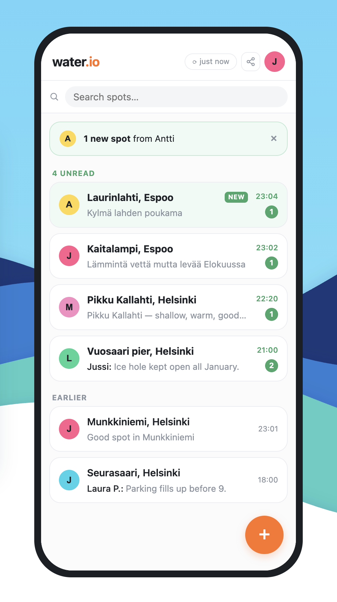
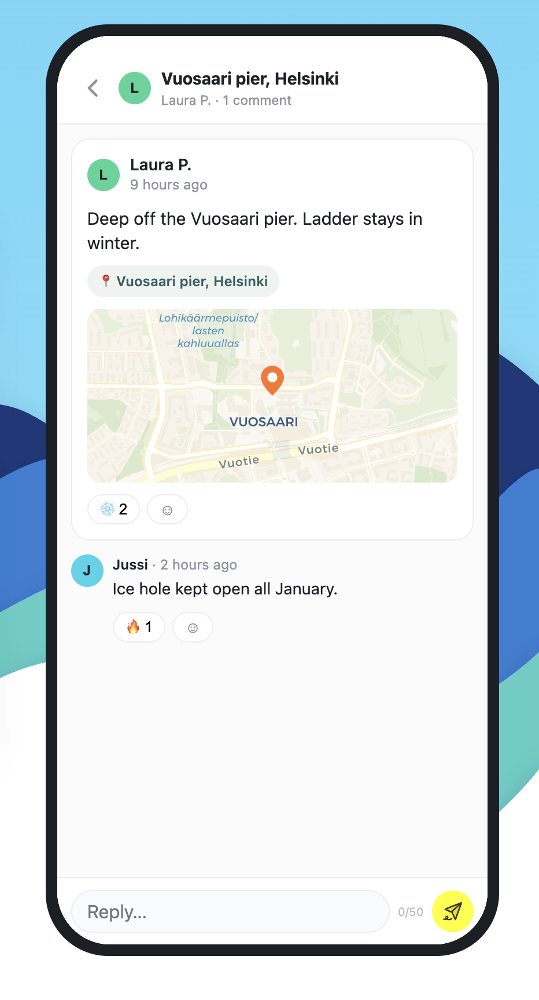

# water.io

> Share and discover open water swimming spots. No servers, no databases — just links.

[](https://opensource.org/licenses/MIT)


## Features

- **Discover spots** — Find swimming locations shared by others
- **Add photos** — Upload images with GPS location extraction
- **Share via URL** — Share your spots with anyone via a simple link
- **Merge data** — Combine shared links with your existing spots
- **React & comment** — Add reactions and comments to spots
- **Mobile-first** — Optimized for phones with bottom sheets

## Screenshots

| Feed | New Spot | Share Modal |
|------|----------|-------------|
|  | |

| Reactions | Merge | Comments |
|-----------|-------|----------|
|  |

## Quick Start

### Try it live
[https://jussikauhanen.github.io/water.io/](https://jussikauhanen.github.io/water.io/)

### Run locally
```bash
# Clone the repo
git clone https://github.com/jussikauhanen/water.io.git

# Open in browser
cd water.io
open index.html
```

## How It Works

- **Add a spot** — Enter description, optional photo, and location
- **Get a link** — Click share to generate a URL with all your spots
- **Share it** — Send the link via WhatsApp, Facebook, or copy the URL
- **Merge updates** — Open shared links to merge new spots with your data

## Technical Details

- **Storage:** LocalStorage (persists in your browser)
- **Sharing:** URL-encoded JSON compressed with LZString
- **Images:** Stored in LocalStorage, referenced by ID in URLs
- **IDs:** Timestamp-based for automatic sorting and easy merging
- **No backend:** Fully client-side, works on GitHub Pages

## Architecture

```
User adds spot → Saved to LocalStorage → Share generates URL
     ↓                                           ↓
Merge shared data ← Open link ← Share via WhatsApp/Email
```

## Browser Support

Works on all modern browsers:

- Chrome / Edge (desktop & mobile)
- Firefox
- Safari (iOS & macOS)
- Opera

## Limitations

- **Images:** Only visible to users who have them in LocalStorage
- **URL length:** Limited to ~2000 characters (handles ~50-100 spots)
- **No authentication:** Username is stored locally only

## License

MIT License - see LICENSE file for details.

## Contributing

1. Fork the repository
2. Create your feature branch (`git checkout -b feature/amazing`)
3. Commit your changes (`git commit -m 'Add some amazing feature'`)
4. Push to the branch (`git push origin feature/amazing`)
5. Open a Pull Request

## Acknowledgments

- Built with vanilla JavaScript
- Uses LZString for URL compression
- Inspired by real-world open water swimming communities & Teammates in Orca
- Made for swimmers who share ❤️